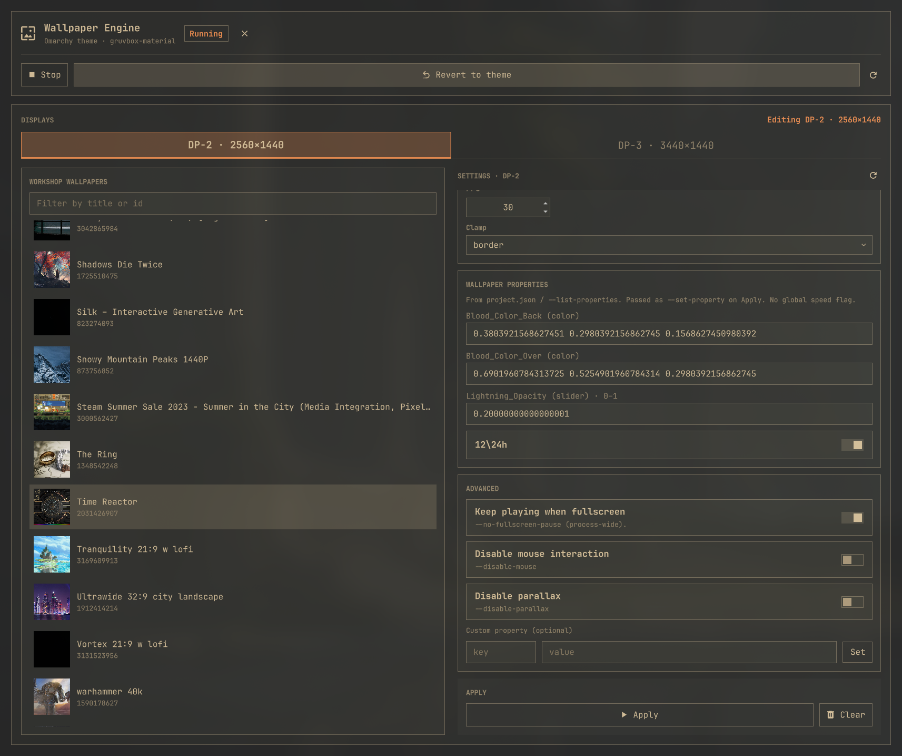
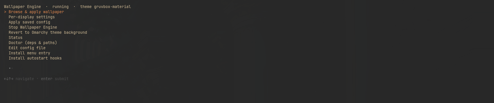

# Wallpaper Engine for Omarchy

Omarchy shell plugin that plays [Steam Wallpaper Engine](https://store.steampowered.com/app/431960/) scenes on Hyprland through [Almamu/linux-wallpaperengine](https://github.com/Almamu/linux-wallpaperengine).

It ships a **Quickshell GUI** (`FloatingWindow`, one tab per Hyprland output), an optional bar widget, Omarchy **Style** menu entries, a gum TUI fallback, and hooks. Browse Workshop wallpapers, set per-display scaling/FPS/clamp/audio/properties, start or stop `linux-wallpaperengine`, and **revert to the current Omarchy theme background**.

<p align="center">
  
</p>

## Highlights

- Native Omarchy/Quickshell panel with one live tab per Hyprland display.
- Workshop browsing with thumbnails, search, and wallpaper-specific properties.
- Independent wallpaper process, FPS, scaling, clamp, and audio settings per display.
- First-frame validation before replacing a running wallpaper, so a failed item does not blank the display.
- One-click stop and safe restore of the current Omarchy theme background.
- Optional bar widget, Style menu actions, CLI, boot hook, theme hook, and gum TUI.

## Dependencies

| Dependency | Notes |
|---|---|
| **Omarchy** (Hyprland + Quickshell) | Theme background APIs, Style menu, shell panel, hooks |
| **linux-wallpaperengine** | AUR: `linux-wallpaperengine-git` — binary `linux-wallpaperengine` on `PATH` |
| **Wallpaper Engine on Steam** | Owns assets + Workshop content (`431960`) |
| `jq`, `hyprctl` | Present on a normal Omarchy install |
| `gum` | Only for the optional advanced TUI |

Optional: `"nvidia_workaround": true` in config runs the engine with `__GL_THREADED_OPTIMIZATIONS=0`.

## Install

Omarchy plugins have **no post-install hooks**. After adding the plugin, run the explicit helper once.

**Do not** install by symlink into `~/.config/omarchy/plugins/`. Qt QML compares the plugin URL to the real path; a symlink from lowercase `wallpaper-engine-omarchy` to a mixed-case repo (`Wallpaper-Engine-Omarchy`) can fail with `File name case mismatch`. `install.sh` **copies** into that lowercase plugin-id directory.

```bash
# From GitHub (clones into ~/.config/omarchy/plugins/<id>/ as a real directory)
omarchy plugin add https://github.com/14brussell/Wallpaper-Engine-Omarchy.git --enable
~/.config/omarchy/plugins/wallpaper-engine-omarchy/scripts/install.sh

# Or locally while developing — copy, never ln -sfn
/path/to/Wallpaper-Engine-Omarchy/scripts/install.sh
omarchy plugin enable wallpaper-engine-omarchy
```

Re-run `scripts/install.sh` after editing the source tree so QML and hooks pick up the copy. The installer validates a hidden staging tree, exposes it with one atomic replacement, and rolls back if the enabled service does not report the new generation. For an enabled plugin it uses one supported shell restart, avoiding Omarchy's unsafe in-process reload state; it does not request an additional plugin rescan. The script also links `omarchy-we` / `we-omarchy` into `~/.local/bin`.

The always-loaded service is deliberately tiny and creates no windows. Applying and reverting are direct backend operations; the plugin never places a full-screen QML transition surface over the desktop.

If the shell was already running and the overlay still failed to load:

```bash
omarchy-shell shell rescanPlugins
```

Validate before publishing:

```bash
omarchy plugin validate ./Wallpaper-Engine-Omarchy
```

## Usage

Style menu entries are **siblings** (not a submenu):

| How | Action |
|---|---|
| Omarchy menu | **Style → Wallpaper Engine** — open the Quickshell GUI |
| One-shot revert | **Style → Revert to theme background** |
| Advanced TUI | **Style → Wallpaper Engine (advanced TUI)** or middle-click the bar icon |
| Bar widget | Left-click toggles the GUI; right-click reverts to theme; middle-click opens the TUI |
| CLI | `omarchy-we panel` · `omarchy-we apply` · `omarchy-we stop` · `omarchy-we revert` · `omarchy-we menu` |

### GUI (tab per display)

The panel is a tileable Quickshell `FloatingWindow` (no desktop dimmer / modal scrim). Keep it beside other windows and judge the live wallpaper while tweaking.

1. Open the panel (Style menu, bar icon, or `omarchy-we panel`).
2. Pick a **display tab** (one tab per live Hyprland monitor — names and sizes come from `hyprctl`, nothing is hardcoded).
3. Inside that tab: choose a Workshop wallpaper, then set scaling, FPS, clamp, Wayland layer, audio, audio processing, fullscreen-pause rules, particles, mouse, parallax, and wallpaper properties. **Apply** (or **Apply & start** if that display is down) writes only that display’s config and runs `we apply <monitor>`. **Clear** drops that display from config and stops only its process.
4. Global actions **above** the tabs (not per-display):
   - **Start** — shown while the engine is stopped; enabled once at least one display has a saved wallpaper. Runs `we apply` for every configured output.
   - **Stop** — stops all plugin-owned wallpaper processes and clears the active flag.
   - **Revert to theme** — stops the wallpaper processes and restores the canonical Omarchy theme image.

Status badge: **Running** (live process), **Configured** (wallpapers saved, engine down), or **Stopped**.

Switching tabs reloads that display’s saved settings. Editing fields does **not** change which tab is selected. A soft status poll updates the badge without wiping in-progress edits.

### Advanced TUI

The primary interface is the Quickshell panel, but `omarchy-we menu` provides a keyboard-driven fallback for advanced setup and recovery.



## How it works with Omarchy themes

```
Omarchy: omarchy.background  →  WlrLayer.Background  (static image symlink)
WE:      linux-wallpaperengine --layer bottom         (covers the static layer)
```

- **Do not** put WE on `--layer background` — that fights `omarchy.background`.
- **Leave** the Omarchy background service **enabled**.
- Apply / revert / stop / theme-set share a single-flight flock so overlapping clicks cannot corrupt process or theme state.

### Reliable per-display runtime

Each configured output owns one `linux-wallpaperengine` process and one PID identity file. Applying one output starts and validates only that output; it does not restart, reposition, or briefly replace the wallpaper on any other output. A broken Workshop item on one output cannot terminate another output's wallpaper.

On **Apply** for one tab:

1. Validate the selected Workshop project before changing configuration. Dependency-only or otherwise unsupported projects are not shown in the picker and are rejected by the CLI.
2. Start a replacement process for that output while its previous wallpaper remains visible.
3. Require the replacement's private framebuffer screenshot to contain a rendered frame.
4. Atomically publish the new PID identity, then stop only that output's previous process.

`we apply` without monitor arguments attempts every configured display independently. One failure is reported, but successfully started displays remain running. `we revert` stops all plugin-owned display processes and directly restores the saved/current theme background.

Readiness env vars (optional): `WE_LWE_READY_MS` bounds first-frame validation, `WE_LWE_SCREENSHOT_DELAY` controls how many engine frames precede the framebuffer dump, and `WE_LWE_PAINT_EPS` controls uniform-clear detection.

### Hooks

| Hook | Behavior |
|---|---|
| `post-boot.d/50-wallpaper-engine` | If `active=true`, re-`apply` after a short delay |
| `theme-set.d/50-wallpaper-engine` | Save the newly applied theme background for a later revert; running wallpapers remain untouched |

Install with `we install-hooks` (Omarchy never runs plugin post-install automatically).

## Config

`~/.config/omarchy/wallpaper-engine/config.json`

```json
{
  "version": 1,
  "engine": "linux-wallpaperengine",
  "assets_dir": "",
  "nvidia_workaround": false,
  "defaults": {
    "scaling": "fill",
    "fps": 30,
    "silent": true,
    "volume": 15,
    "layer": "bottom",
    "clamp": "border",
    "no_fullscreen_pause": false,
    "fullscreen_pause_only_active": false,
    "fullscreen_pause_ignore_appids": [],
    "noautomute": false,
    "no_audio_processing": false,
    "disable_particles": false,
    "disable_mouse": false,
    "disable_parallax": false
  },
  "displays": {
    "<display-name>": {
      "wallpaper": "823274093",
      "scaling": "fill",
      "fps": 30,
      "silent": true,
      "volume": 15,
      "layer": "bottom",
      "clamp": "border",
      "no_fullscreen_pause": false,
      "fullscreen_pause_only_active": false,
      "fullscreen_pause_ignore_appids": [],
      "noautomute": false,
      "no_audio_processing": false,
      "disable_particles": false,
      "disable_mouse": false,
      "disable_parallax": false,
      "properties": { "rate": "1.0" }
    }
  },
  "active": false,
  "saved_theme_background": null
}
```

State, per-display PID identities, and per-display logs: `~/.local/state/omarchy/wallpaper-engine/`.

Workshop scan (auto-detected, plus optional `workshop_dirs` in config): Steam `workshop/content/431960/<id>/project.json`.

## Engine CLI notes

Representative command built by `we apply`:

```bash
linux-wallpaperengine \
  --layer bottom --fps 30 --silent --disable-particles \
  --screenshot ~/.local/state/omarchy/wallpaper-engine/lwe-ready.<display>.<time>.jpg --screenshot-delay 5 \
  --screen-root <display> --bg 914607822 --scaling stretch --clamp border
```

GUI / tab call sequence (one display at a time):

```bash
display="<your-output-name>"     # from: we monitors
we set-display "$display" --wallpaper 823274093 --scaling fill --fps 30
we apply "$display"              # starts/replaces this output only
we display-config "$display" --json
# or: we status --json           # includes .effectiveDisplays
```

- `--scaling` / `--clamp` apply to the **previous** `--screen-root` / `--bg` group.
- Stop / change settings uses plugin-owned PID + process-start-time identities; no broad `pkill` and no engine IPC.
- **No global playback-speed flag.** Use wallpaper properties:
  - `we properties <id>` → `linux-wallpaperengine --list-properties`
  - `we set-property <monitor> rate 1.0` → passed as `--set-property rate=1.0`
- Clamp flag is `--clamp` (not `--clamping`).

GUI helpers: `we list --json`, `we status --json`, `we display-config <mon> --json`, `we panel`.

## Layout

```
manifest.json          # Omarchy plugin id: wallpaper-engine-omarchy
BarWidget.qml          # Bar launcher (toggles panel)
Panel.qml              # Quickshell GUI — FloatingWindow + Start/Stop/Revert + per-display tabs
DisplayTab.qml         # One tab’s wallpaper browser + settings + Apply / Clear
bin/we                 # CLI
Service.qml            # Windowless install-generation health endpoint
lib/common.sh          # Per-display engine lifecycle + theme integration
scripts/we-menu        # gum TUI (advanced fallback)
scripts/we-menu-entry  # Style menu install/remove
scripts/install-hooks  # post-boot + theme-set
scripts/install.sh     # copy into plugins/<id>/ + menu + hooks + ~/.local/bin links
hooks/                 # Reference hook scripts
assets/we-placeholder.png
```

## Limitations

- FPS, silent, and volume settings are independent because every display has its own engine process.
- Horizontal wallpaper mirroring is not currently available in `linux-wallpaperengine` (its CLI has no flip/mirror option). Wallpaper Engine’s native Flip feature is scene-only, so the plugin does not show a non-functional generic mirror toggle. A wallpaper-specific flip property still appears automatically when a Workshop item actually exposes one.
- Not every Workshop wallpaper exposes a `rate`/`speed` property — use the property fields for what that wallpaper supports (`we properties <id>`).
- Audio-reactive / mouse-interactive scenes depend on linux-wallpaperengine support for that content.
- LWE has no ready IPC. The plugin uses its per-process framebuffer dump as a bounded first-frame check before replacing an existing process. A wallpaper that never produces a structured frame is rejected and the prior process is retained.
